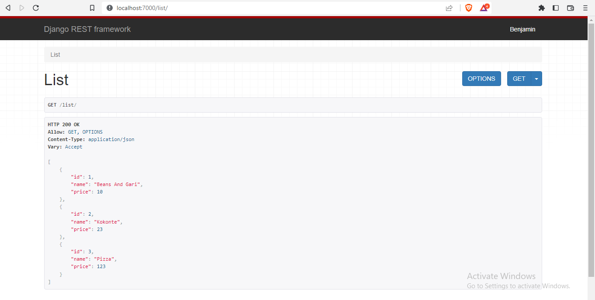
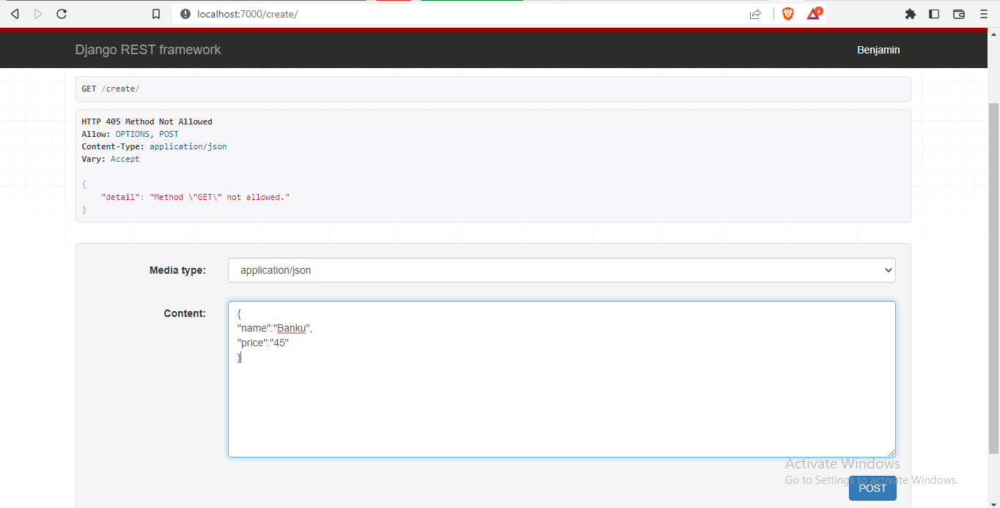
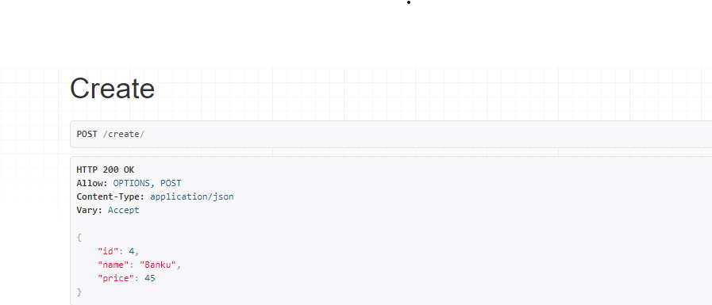
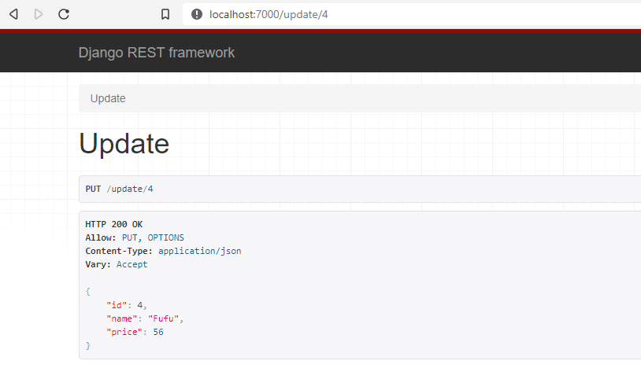
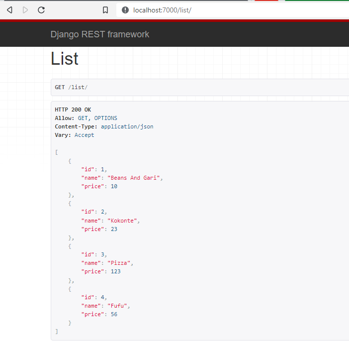
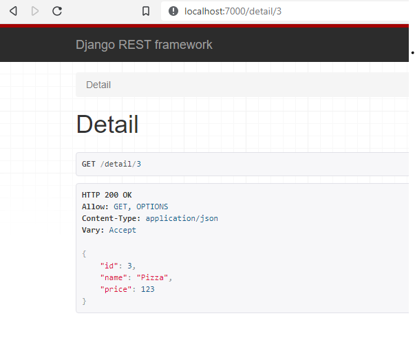
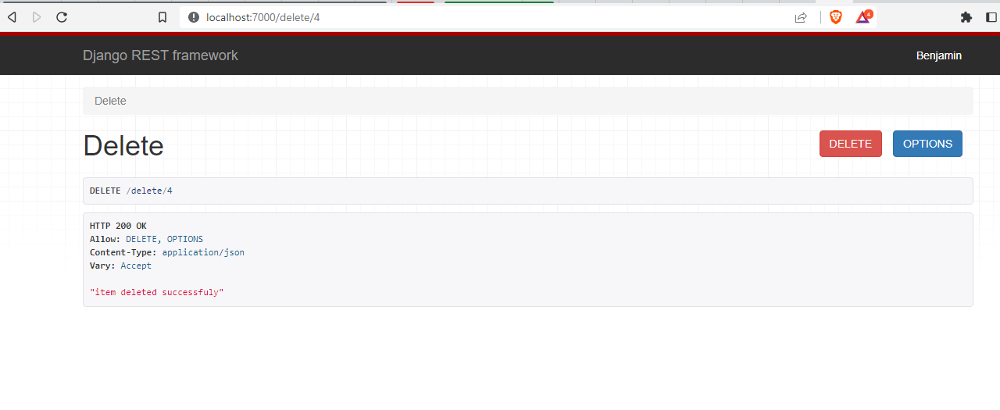

<h1>This project tests a python package made by <i>Shaphat</i> </h1>

This package manages all the <b>CRUD fuctionalities</b> in Django

--Create 
--Read(List) 
--Update 
--Delete 
--Detail 
 

In order to test this package <b>I modelled a menu about a restaurant</b>   
The server was running on <b>port 7000<b>  
I created a couple of food menus from the admin dashboard provided by Django 
I created three <b>3 menus</b> 

 

To test the CREATE of the package.I created a new menu<b>(Banku with a price of 45)<b> 
Django automatically assigns it an id of <b>4</b> 

 

 
After the CREATE I decided to use the UPDATE to modify it 
I changed the <b>banku</b> to <b>Fufu</b> 
 
This then became the new food menus  
 

Also tested the <b>DETAIL</b> 
 

Finally decided to <b>DELETE</b> our created menu 
 

<h2>CONCLUSION</h2>
The package is great

<h3>LINK TO PACKAGE</h3>
https://pypi.org/project/my-django-crud/

